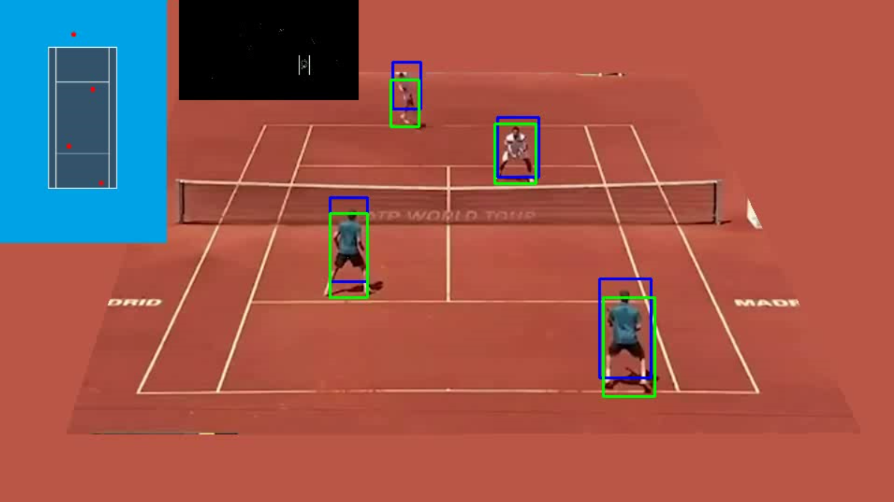

# FieldVision

## Overview

This project presents an object-tracking system designed for mapping and monitoring players on a sports field. It combines the Meanshift algorithm with the Kalman Filter to track player movements accurately and manage occlusions effectively. Direct Linear Transformation (DLT) is used to project the 2D playing surface into a top-down representation, enhancing the analysis of player movements.

### Key Features

- **Tracking with Meanshift:** The Meanshift algorithm provides non-parametric, feature-based tracking, focusing reliably on players even in densely populated scenes.
- **Occlusion Handling with Kalman Filter:** The Kalman Filter plays a crucial role in maintaining tracking continuity by predicting player positions during occlusions or when players momentarily disappear from view, ensuring consistent tracking performance.
- **Spatial Mapping via DLT:** Direct Linear Transformation accurately maps 2D player positions onto a top-down view of the field, offering a clear perspective for tactical analysis.

## Sources
- Salhi, A., & Yengui Jammoussi, A. (2012). Object tracking system using Camshift, Meanshift, and Kalman filter. International Journal of Electronics and Communication Engineering, 6(4). World Academy of Science, Engineering and Technology.
